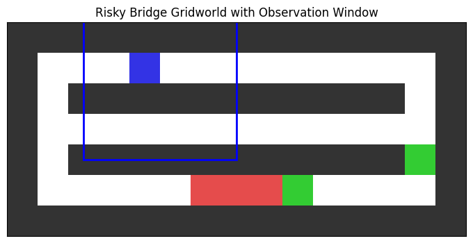
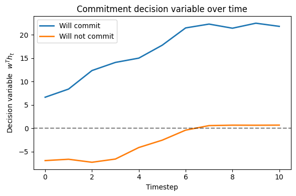
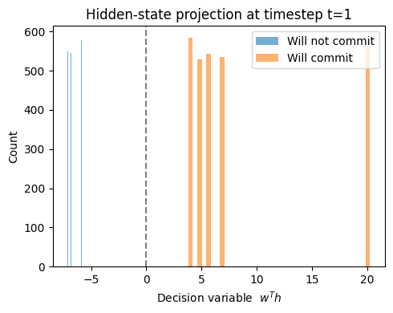

# Mechanistic Interpretability of Risk Commitment in a DRQN (Risky Bridge Gridworld)

This repository contains code and experiments for a mechanistic interpretability study of a **Deep Recurrent Q-Network (DRQN)** trained in a **risk-sensitive POMDP gridworld** (“risky bridge” environment). The goal is to understand *how* a recurrent RL agent internally represents and uses latent variables such as **risk commitment / intention**.

---

## 1. Project Goal

We study whether a trained DRQN agent:
1. develops an **internal representation** of risk-related latent variables (e.g., “I will take the risky route”),
2. maintains this representation over time via recurrence,
3. uses it to drive downstream action selection,
4. and whether we can localize this computation to specific hidden units / mechanisms.

In other words, we aim to go beyond behavioral evaluation and show **interpretable internal structure** and **causal mechanisms**.

---

## 2. Environment: Risky Bridge Gridworld (POMDP)

The agent operates in a gridworld with:
- two routes:
  - **safe path**: lower reward, no catastrophic event
  - **risky path**: high reward but contains a hazard region
- a one-shot risk event:
  - entering the hazard region resolves risk once
  - with probability `slip_prob = 0.1`, the episode catastrophically terminates with a large negative reward
- partial observability:
  - observations are local (5×5 window) with channels for walls/goals (and optionally hazard visibility for analysis)

We additionally use **randomized starting positions** so that time index is not trivially aligned with route commitment, enabling time-matched probing.

---

## 3. Agent: DRQN (Recurrent Q-learning)

We use:
- a DRQN with:
  - MLP encoder
  - LSTM recurrent core
  - linear Q-head
- **sequence replay buffer** with burn-in
- Double DRQN-style bootstrapping
- valid-action masking (prevents invalid moves)

The training checkpoints are saved to support later “model development story” analyses across training time.

---

## 4. Core Mechanistic Interpretability Pipeline

### Step 0 — Rollout Data Collection (with internal states)
We run deterministic greedy rollouts from a chosen checkpoint and record full traces including:
- observation (flattened 75-dim)
- action, reward
- true underlying state (`pos`) for semantic labeling (not provided to the agent)
- Q-values
- LSTM hidden state `h`
- LSTM cell state `c`
- environment flags:
  - `used_risky`
  - `risk_resolved`

This creates a dataset of step-level samples across thousands of episodes.

---

### Step 1 — Semantic Labeling
We add episode- and timestep-level semantic labels:
- `commit_t`: first timestep where risk is committed
- `risk_committed`: whether the episode has committed to risk and the current timestep is at/after commitment
- `semantic_state`:
  - `pre_commit`
  - `commit_step`
  - `post_resolution`
  - `never_commit`
- `outcome`:
  - reached risky goal / safe goal
  - terminated elsewhere
  - timeout

This transforms raw trajectories into interpretable causal slices.

---

### Dataset Sanity Checks
We include utilities to verify:
- required keys exist for each row
- tensor shapes are consistent (`obs` 75, `q` 4, `h/c` 128)
- timesteps are consecutive within episodes
- semantic labeling is self-consistent
- commitment step appears exactly once per committing episode

---

## 5. Main Empirical Finding (So Far): Early Intention is Linearly Decodable

### Intention definition (`will_commit`)
We define a key semantic label:

**`will_commit` = whether the episode will ever commit to the risky route**  
(i.e., whether `commit_t` exists for that episode).

This label is computed at the episode level but probed at the timestep level to test whether DRQN internally encodes early “intention.”

---

## 6. Probing Results (Representation Exists and is Strong)

We train **logistic regression probes** on DRQN hidden state features, using:
- strict episode split (train/test separated by episodes)
- balanced training sets to avoid class imbalance artifacts
- optional label-shuffle control

### Key result
A probe trained on early hidden states (`h`) predicts `will_commit` with **near-perfect accuracy across timesteps**, meaning:

- The DRQN hidden state contains a **robust, linearly decodable representation**
  of whether the agent will take the risky route, **very early in the trajectory**.

### Shuffle-control
When training labels are shuffled, probe performance collapses towards chance,
supporting the claim that the decoding performance is **not caused by dataset leakage**.

---

## 7. Interpretation / Story So Far

Behaviorally, DRQN learns a high-return policy that sometimes chooses risky actions.

Mechanistically, we find that:
- The agent forms a **stable internal intention-like variable** (commitment to risk).
- This intention is present in the recurrent state early, and persists over time.
- The representation is strong enough that a linear probe can recover it almost perfectly.

This sets up the next part of the project: moving from “representation exists” to
**mechanistic localization and causal control**.

---

---

## 8. New Finding: Risk Commitment as an Early Internal Decision Variable

We now move from *“a representation exists”* to a clearer *mechanistic story* about **when** and **how** risk commitment is formed inside the DRQN.

### 8.1 Early Intention Probe (`will_commit`)

We define an episode-level intention label:

**`will_commit`**  
= whether the episode will *eventually* enter the risky region at any later timestep.

Crucially, we probe this label using **early hidden states**, *before* the agent reaches the hazard or commits behaviorally.

---

### 8.2 Result: Intention Is Decodable Almost Immediately

We train linear (logistic regression) probes on the LSTM hidden state `h_t` at different timesteps.

**Key result:**
- From as early as **t = 1**, a linear probe predicts `will_commit` with **near-perfect accuracy**
- This holds across timesteps
- Performance collapses under label-shuffle control

This indicates that the agent forms a **stable internal intention variable very early** in the episode.

---

### 8.3 Timestep Sweep: Intention Over Time

The following plot shows probe accuracy across timesteps:

**Interpretation:**
- Blue: probe accuracy with true labels
- Orange: shuffle-label control
- The large gap confirms the signal is real and not a data artifact
- The intention signal appears *before* risk is encountered

---

### 8.4 Hidden-State Separation at a Fixed Timestep

At a fixed early timestep (e.g., `t = 1`), the projected hidden states show near-perfect separation:

**Key observation:**
- Two clearly separated distributions
- Dashed line = linear decision boundary
- This is *before* any risky action is taken

This strongly supports the claim that **risk commitment is an internal decision variable**, not a late reaction to the hazard.

---

## 9. Updated Mechanistic Story

Putting everything together:

1. The DRQN forms an **internal intention to commit or not commit to risk**
2. This intention:
   - appears very early in the episode
   - is stored in the recurrent hidden state
   - persists across time
3. Downstream actions follow this internal variable
4. A simple linear probe can reliably read it out

In short:

> **The agent plans risk internally before acting on it.**

This shifts the interpretation of the policy from reactive behavior to **latent-variable–driven planning**.

---

## 10. Next Step: Mechanistic Localization and Causal Tests

With a strong and stable intention signal identified, the next step is to move from correlation to causation by:

- identifying which hidden units carry the intention signal
- ablating or patching those units
- measuring causal effects on risky behavior and outcomes

This will allow us to explicitly link **internal computation → behavior**, completing the mechanistic analysis.

---

## Notes

- `slip_prob` is held fixed at 0.1 to preserve stochastic catastrophic risk.
- Probe datasets are balanced at train-time to prevent “always predict majority class” artifacts.
- Episode-level splitting is enforced to avoid leakage across correlated timesteps within an episode.

---